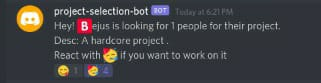
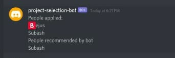

#Project Selection bot

##Introduction
Project selection bot is a discord bot built with javascript. People interested in working on a project react to the bot's message and the bot recommends the people who should work on the project based on their existing projects.

## Project setup
1. Clone the repository: `git clone https://github.com/TejusR/project-selection-bot`
2. Go to the project directory: `cd project-selection-bot`
3. Copy the contents of .env.example to .env and set the value of bot token and kitchen auth token
4. Install dependencies: `npm install
5. Run the bot: `node index.js`

## Bot usage
####looking for people command:
    `!looking-for-people <number of people> <project description>`
Example:

####React to the bot's message to show that you're interested

####Results Command:
`!results` to see the recommended people
